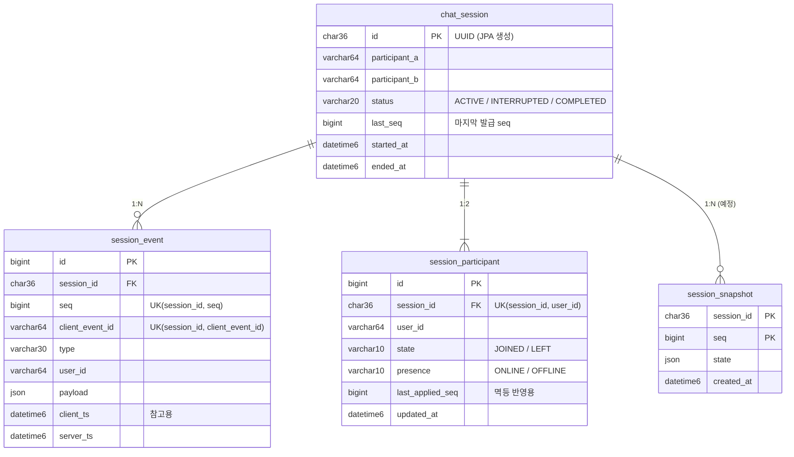

# 1. 도메인 모델, ERD, DDL

> 기준: Flyway `V1__init.sql`, `V2__session_participant.sql` (현재 적용된 스키마)

## 1.1 핵심 도메인

| 도메인 | 역할 | 테이블 | 성격 |
|---|---|---|---|
| Session | 1:1 대화 단위. 허용 참여자 2명, 상태, 마지막 seq | `chat_session` | 쓰기 모델 (seq 발급·락의 기준점) |
| Event | 세션에서 일어난 모든 사실 | `session_event` | **진실의 원천(source of truth)**, append-only |
| Participant | 참여자별 현재 상태 (입장/퇴장, 온라인 여부) | `session_participant` | 이벤트에서 파생된 **프로젝션** |
| Snapshot | 특정 seq 시점의 세션 상태 | `session_snapshot` | 복원 가속용 (구현 예정) |

### 이벤트 타입

| 타입 | 누가 만드나 | payload | 참여자 상태 변화 |
|---|---|---|---|
| `SESSION_STARTED` | 서버 (세션 생성 시) | `{participantA, participantB}` | - |
| `JOINED` | 클라이언트 | - | state=JOINED, presence=ONLINE |
| `LEFT` | 클라이언트 | - | state=LEFT, presence=OFFLINE |
| `MESSAGE_SENT` | 클라이언트 | `{text}` | - |
| `DISCONNECTED` | 서버 (WebSocket 끊김 감지) | - | presence=OFFLINE |
| `RECONNECTED` | 서버 (WebSocket 재연결 감지) | - | presence=ONLINE |
| `SESSION_ENDED` | 클라이언트 | - | 세션 status=COMPLETED |

### 세션 상태

| 상태 | 의미 |
|---|---|
| `ACTIVE` | 진행 중 |
| `INTERRUPTED` | 중단 (설계만, 구현 예정: 참여자 끊김이 유예 시간을 넘길 때) |
| `COMPLETED` | 종료. 이후 모든 신규 이벤트 거부 (재전송은 최초 결과로 응답) |

### 참여자 상태

| 필드 | 값 | 초기값 |
|---|---|---|
| `state` | `JOINED` / `LEFT` | `LEFT` (세션 생성 시 아직 입장 전) |
| `presence` | `ONLINE` / `OFFLINE` | `OFFLINE` |

## 1.2 ERD



## 1.3 핵심 DDL

```sql
-- V1: 세션 (seq 발급과 락의 기준점)
CREATE TABLE chat_session (
    id              CHAR(36)    NOT NULL PRIMARY KEY,
    participant_a   VARCHAR(64) NOT NULL,
    participant_b   VARCHAR(64) NOT NULL,
    status          VARCHAR(20) NOT NULL,
    last_seq        BIGINT      NOT NULL DEFAULT 0,
    started_at      DATETIME(6) NOT NULL,
    ended_at        DATETIME(6) NULL
) ENGINE=InnoDB DEFAULT CHARSET=utf8mb4;

-- V1: 이벤트 저장소 (append-only)
CREATE TABLE session_event (
    id               BIGINT      NOT NULL AUTO_INCREMENT PRIMARY KEY,
    session_id       CHAR(36)    NOT NULL,
    seq              BIGINT      NOT NULL,
    client_event_id  VARCHAR(64) NOT NULL,
    type             VARCHAR(30) NOT NULL,
    user_id          VARCHAR(64) NOT NULL,
    payload          JSON        NULL,
    client_ts        DATETIME(6) NULL,
    server_ts        DATETIME(6) NOT NULL,
    CONSTRAINT fk_event_session   FOREIGN KEY (session_id) REFERENCES chat_session(id),
    CONSTRAINT uk_event_seq       UNIQUE (session_id, seq),
    CONSTRAINT uk_event_client_id UNIQUE (session_id, client_event_id),
    INDEX idx_event_session_server_ts (session_id, server_ts)
) ENGINE=InnoDB DEFAULT CHARSET=utf8mb4;

-- V1: 스냅샷 (복원 가속용, 사용은 구현 예정)
CREATE TABLE session_snapshot (
    session_id  CHAR(36)    NOT NULL,
    seq         BIGINT      NOT NULL,
    state       JSON        NOT NULL,
    created_at  DATETIME(6) NOT NULL,
    PRIMARY KEY (session_id, seq),
    CONSTRAINT fk_snapshot_session FOREIGN KEY (session_id) REFERENCES chat_session(id)
) ENGINE=InnoDB DEFAULT CHARSET=utf8mb4;

-- V2: 참여자 프로젝션
CREATE TABLE session_participant (
    id               BIGINT      NOT NULL AUTO_INCREMENT PRIMARY KEY,
    session_id       CHAR(36)    NOT NULL,
    user_id          VARCHAR(64) NOT NULL,
    state            VARCHAR(10) NOT NULL,
    presence         VARCHAR(10) NOT NULL,
    last_applied_seq BIGINT      NOT NULL,
    updated_at       DATETIME(6) NOT NULL,
    CONSTRAINT uk_participant UNIQUE (session_id, user_id),
    INDEX idx_participant_user (user_id, session_id),
    CONSTRAINT fk_participant_session FOREIGN KEY (session_id) REFERENCES chat_session(id)
) ENGINE=InnoDB DEFAULT CHARSET=utf8mb4;
```

## 1.4 인덱스 설계 근거 (핫패스)

| 인덱스 | 사용하는 쿼리 | 근거 |
|---|---|---|
| `chat_session` PK | 이벤트 수집 시 `SELECT ... FOR UPDATE` | 모든 쓰기의 시작점. PK 단건 조회라 락 범위가 행 하나로 한정됨 |
| `uk_event_client_id (session_id, client_event_id)` | 중복 확인 `WHERE session_id=? AND client_event_id=?` | 모든 쓰기마다 실행. 동시에 **DB 수준의 중복 저장 최후 방어선** |
| `uk_event_seq (session_id, seq)` | 재연결 동기화·이력 조회 `WHERE session_id=? AND seq>? ORDER BY seq` | 인덱스 순서대로 읽어 정렬이 필요 없음. 동시에 **seq 중복의 최후 방어선** |
| `idx_event_session_server_ts (session_id, server_ts)` | 시각 기준 복원 `?at=` → 해당 시각 이전 마지막 seq | 시각 → seq 변환을 인덱스 탐색 1회로 처리 (구현 예정) |
| `uk_participant (session_id, user_id)` | 참여자 상태 조회·갱신 | 메시지 전송 시 JOINED 확인, 입장/퇴장 반영 |
| `idx_participant_user (user_id, session_id)` | 사용자별 세션 목록 `GET /sessions?participant=` | 구현 예정 |

## 1.5 정규화 / 비정규화 / JSON 선택과 트레이드오프

| 선택 | 이유 | 대가 |
|---|---|---|
| 이벤트 payload를 `JSON`으로 저장 | 이벤트 타입마다 필드가 다르고, 새 타입 추가 시 스키마 변경이 없음 | payload 내부 필드로 검색·인덱싱이 어려움 (필요 시 generated column + index) |
| `chat_session.last_seq` 비정규화 | `MAX(seq)+1` 조회 없이 세션 행 락 1회로 seq 발급 | 이벤트와 어긋나지 않도록 **같은 트랜잭션에서만** 갱신 |
| `session_participant`를 별도 프로젝션으로 | 현재 상태 조회를 이벤트 리플레이 없이 처리 | 이벤트와 불일치 가능성 → 같은 트랜잭션에서 갱신 + `last_applied_seq`로 멱등 반영. 이론상 이벤트로 언제든 재생성 가능 |
| 허용 참여자(A/B)를 `chat_session`에 고정 | 1:1 서비스의 불변 조건("누가 참여할 수 있나")을 세션 생성 시 확정 | N:N으로 확장하려면 참여자 테이블 중심으로 재설계 필요 |
| enum은 `STRING`으로 저장 | `ORDINAL`은 enum 순서가 바뀌면 기존 데이터 의미가 조용히 바뀜 | 저장 공간이 약간 큼 |
