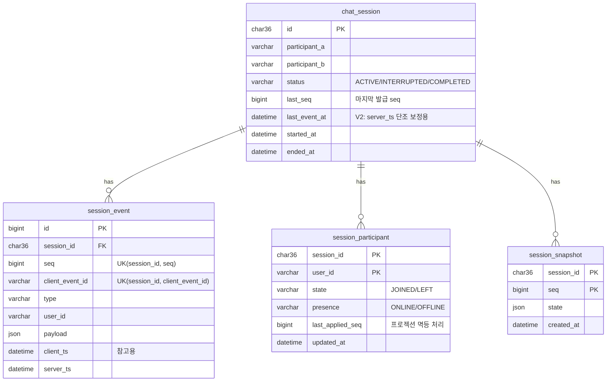

# 1. 도메인 모델, ERD, DDL

> 상태: **초안** (V1 스키마 반영, V2 변경안 포함)

## 1.1 핵심 도메인

| 도메인 | 역할 | 저장 방식 |
|---|---|---|
| Session | 1:1 대화 단위. 허용 참여자, 상태, 마지막 seq | `chat_session` (쓰기 모델) |
| Event | 세션에서 일어난 모든 사실. **진실의 원천(source of truth)** | `session_event` (append-only) |
| Participant | 세션별 참여자의 현재 상태 (입장/퇴장, 온라인 여부) | `session_participant` (이벤트에서 파생된 프로젝션) |
| Snapshot | 특정 seq 시점의 세션 상태 전체 | `session_snapshot` (복원 가속용) |

이벤트 타입

| 타입 | 발생 주체 | payload 예시 |
|---|---|---|
| `SESSION_STARTED` | 서버 | `{participantA, participantB}` |
| `JOINED` / `LEFT` | 클라이언트 | `{}` |
| `MESSAGE_SENT` | 클라이언트 | `{text}` (messageId = clientEventId) |
| `MESSAGE_EDITED` | 클라이언트 | `{messageId, text}` |
| `MESSAGE_DELETED` | 클라이언트 | `{messageId}` |
| `DISCONNECTED` / `RECONNECTED` | 서버 (WebSocket 연결 감지) | `{reason}` |
| `SESSION_ENDED` | 클라이언트 또는 서버 | `{reason}` |

## 1.2 ERD



## 1.3 DDL

- V1 (적용됨): `src/main/resources/db/migration/V1__init.sql`
- V2 (예정): 아래

```sql
-- V2__participant_and_ordering.sql (초안)
ALTER TABLE chat_session
    ADD COLUMN last_event_at DATETIME(6) NULL,
    ADD INDEX idx_session_status_started (status, started_at);

CREATE TABLE session_participant (
    session_id        CHAR(36)    NOT NULL,
    user_id           VARCHAR(64) NOT NULL,
    state             VARCHAR(10) NOT NULL,          -- JOINED / LEFT
    presence          VARCHAR(10) NOT NULL,          -- ONLINE / OFFLINE
    last_applied_seq  BIGINT      NOT NULL,          -- 이 seq 이하 이벤트는 이미 반영됨
    updated_at        DATETIME(6) NOT NULL,
    PRIMARY KEY (session_id, user_id),
    INDEX idx_participant_user (user_id, session_id),
    CONSTRAINT fk_participant_session FOREIGN KEY (session_id) REFERENCES chat_session(id)
) ENGINE=InnoDB DEFAULT CHARSET=utf8mb4;
```

## 1.4 인덱스 설계 근거 (핫패스)

| 인덱스 | 사용하는 쿼리 | 근거 |
|---|---|---|
| `uk_event_seq (session_id, seq)` | 재연결 resume(`seq > ?`), 복원 리플레이(`seq BETWEEN`) | 가장 빈번한 조회. 세션 내 seq 범위 스캔이 인덱스 순서 그대로 읽힘(정렬 불필요) |
| `uk_event_client_id (session_id, client_event_id)` | 중복 이벤트 확인 | 멱등성 보장을 DB 제약으로 강제 (애플리케이션 체크만으로는 동시 요청에서 뚫림) |
| `idx_event_session_server_ts (session_id, server_ts)` | `?at=` 시각 → seq 변환 | 시각 기준 복원 시 해당 시각 이전의 마지막 seq를 찾음 |
| `session_snapshot PK (session_id, seq)` | 목표 seq 이하 최신 스냅샷 | `ORDER BY seq DESC LIMIT 1`이 인덱스 역방향 1건 조회로 끝남 |
| `idx_participant_user (user_id, session_id)` | `GET /sessions?participant=` | 사용자별 세션 목록 |
| `idx_session_status_started (status, started_at)` | `GET /sessions?status=&from=&to=` | 상태 + 기간 필터 |

## 1.5 정규화 / 비정규화 / JSON 선택과 트레이드오프

| 선택 | 이유 | 대가 |
|---|---|---|
| 이벤트 payload를 `JSON`으로 저장 | 이벤트 타입마다 필드가 다르고, 새 타입 추가 시 스키마 변경이 없음 | payload 내부 필드로 검색·인덱싱이 어려움 (필요 시 generated column + index) |
| `chat_session.last_seq` 비정규화 | seq 발급을 `MAX(seq)+1` 조회 없이 락 1회로 처리 | 이벤트 테이블과 값이 어긋나지 않도록 같은 트랜잭션에서만 갱신 |
| `session_participant`는 프로젝션 | 목록 조회를 이벤트 리플레이 없이 처리 | 이벤트와의 일시적 불일치 가능 → `last_applied_seq`로 멱등 갱신, 언제든 재생성 가능 |
| 스냅샷 `state`를 JSON 통째로 저장 | 복원 시 역직렬화 1회로 끝 | 스냅샷 포맷 변경 시 버전 관리 필요 (`schemaVersion` 필드 예정) |
