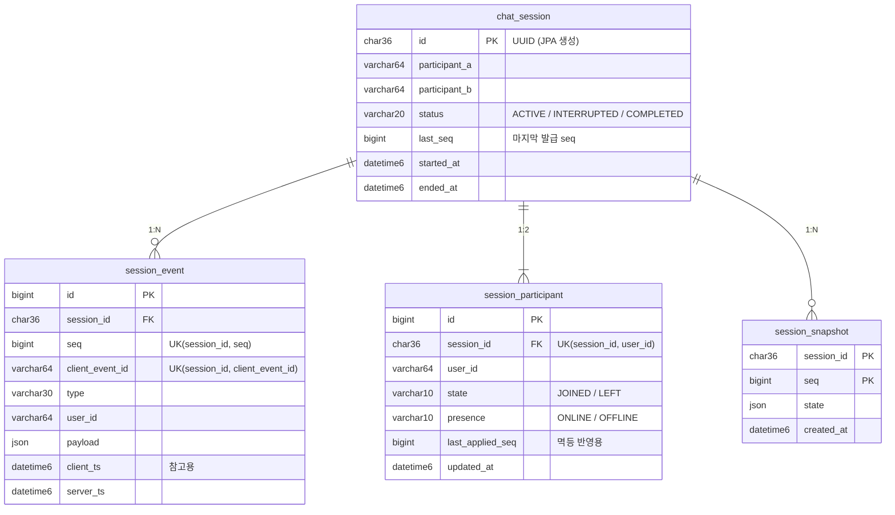

# 3. ERD + 핵심 DDL

## 1. 핵심 도메인

| 도메인 | 역할 | 테이블 | 성격 |
|---|---|---|---|
| Session | 1:1 대화 단위. 허용 참여자 2명, 상태, 마지막 seq | `chat_session` | 쓰기 모델 (seq 발급, 락의 기준점) |
| Event | 세션에서 일어난 모든 사실 | `session_event` | **진실의 원천(source of truth)**, append-only |
| Participant | 참여자별 현재 상태 (입장/퇴장, 온라인 여부) | `session_participant` | 이벤트에서 파생된 **프로젝션** |
| Snapshot | 특정 seq 시점의 세션 상태 | `session_snapshot` | 복원을 빠르게 하는 캐시. 100개마다, 종료 시 비동기 생성. 스냅샷이 없으면 이벤트를 처음부터 다시 적용해 **같은 결과**를 낸다 (느릴 뿐 틀리지 않음) |

### 이벤트 타입

| 타입 | 누가 만드나 | payload | 참여자 상태 변화 |
|---|---|---|---|
| `SESSION_STARTED` | 서버 (세션 생성 시) | `{participantA, participantB}` | - |
| `JOINED` | 클라이언트 | - | state=JOINED, presence=ONLINE |
| `LEFT` | 클라이언트 | - | state=LEFT, presence=OFFLINE |
| `MESSAGE_SENT` | 클라이언트 | `{text}` | - |
| `DISCONNECTED` | 서버 (WebSocket 끊김 감지) | - | presence=OFFLINE |
| `RECONNECTED` | 서버 (WebSocket 재연결 감지) | - | presence=ONLINE |
| `SESSION_ENDED` | 클라이언트 | - | 세션 status=COMPLETED |

### 세션 상태

| 상태 | 의미 |
|---|---|
| `ACTIVE` | 진행 중 |
| `INTERRUPTED` | 미사용. 끊김은 세션 전체가 아니라 참여자 한 명에게 일어나는 일이므로 참여자 presence(OFFLINE)로 표현 |
| `COMPLETED` | 종료. 이후 모든 신규 이벤트 거부 (재전송은 최초 결과로 응답) |

### 참여자 상태

| 필드 | 의미                                                  | 값 | 초기값 |
|---|-----------------------------------------------------|---|---|
| `state` | 방에 들어와 있나 (사용자가 의도적으로 입장, 퇴장)                       | `JOINED` / `LEFT` | `LEFT` (세션 생성 시 아직 입장 전) |
| `presence` | 이 대화방에 지금 접속해 있나 (연결 끊김, 재연결). 퇴장한 사람은 항상 `OFFLINE` | `ONLINE` / `OFFLINE` | `OFFLINE` |

실제 서비스 시나리오로 본 두 필드의 차이: [5 §2](5-design.md#2-join--leave-presence-이벤트-수집-api--구현-완료)

## 2. ERD



## 3. 핵심 DDL

```sql
-- V1: 세션 (seq 발급과 락의 기준점)
CREATE TABLE chat_session (
    id              CHAR(36)    NOT NULL PRIMARY KEY,
    participant_a   VARCHAR(64) NOT NULL,
    participant_b   VARCHAR(64) NOT NULL,
    status          VARCHAR(20) NOT NULL,
    last_seq        BIGINT      NOT NULL DEFAULT 0,
    started_at      DATETIME(6) NOT NULL,
    ended_at        DATETIME(6) NULL
) ENGINE=InnoDB DEFAULT CHARSET=utf8mb4;

-- V1: 이벤트 저장소 (append-only)
CREATE TABLE session_event (
    id               BIGINT      NOT NULL AUTO_INCREMENT PRIMARY KEY,
    session_id       CHAR(36)    NOT NULL,
    seq              BIGINT      NOT NULL,
    client_event_id  VARCHAR(64) NOT NULL,
    type             VARCHAR(30) NOT NULL,
    user_id          VARCHAR(64) NOT NULL,
    payload          JSON        NULL,
    client_ts        DATETIME(6) NULL,
    server_ts        DATETIME(6) NOT NULL,
    CONSTRAINT fk_event_session   FOREIGN KEY (session_id) REFERENCES chat_session(id),
    CONSTRAINT uk_event_seq       UNIQUE (session_id, seq),
    CONSTRAINT uk_event_client_id UNIQUE (session_id, client_event_id),
    INDEX idx_event_session_server_ts (session_id, server_ts)
) ENGINE=InnoDB DEFAULT CHARSET=utf8mb4;

-- V1: 스냅샷 (복원 가속용, 사용은 구현 예정)
CREATE TABLE session_snapshot (
    session_id  CHAR(36)    NOT NULL,
    seq         BIGINT      NOT NULL,
    state       JSON        NOT NULL,
    created_at  DATETIME(6) NOT NULL,
    PRIMARY KEY (session_id, seq),
    CONSTRAINT fk_snapshot_session FOREIGN KEY (session_id) REFERENCES chat_session(id)
) ENGINE=InnoDB DEFAULT CHARSET=utf8mb4;

-- V2: 참여자 프로젝션
CREATE TABLE session_participant (
    id               BIGINT      NOT NULL AUTO_INCREMENT PRIMARY KEY,
    session_id       CHAR(36)    NOT NULL,
    user_id          VARCHAR(64) NOT NULL,
    state            VARCHAR(10) NOT NULL,
    presence         VARCHAR(10) NOT NULL,
    last_applied_seq BIGINT      NOT NULL,
    updated_at       DATETIME(6) NOT NULL,
    CONSTRAINT uk_participant UNIQUE (session_id, user_id),
    INDEX idx_participant_user (user_id, session_id),
    CONSTRAINT fk_participant_session FOREIGN KEY (session_id) REFERENCES chat_session(id)
) ENGINE=InnoDB DEFAULT CHARSET=utf8mb4;
```
> 위 DDL의 인덱스를 왜 이렇게 설계했는지는 [4. 주요 쿼리 문서 §3](4-queries.md#3-인덱스-설계-근거-핫패스)에 있다.

## 4. 정규화 / 비정규화 / JSON 선택과 트레이드오프

원본은 `session_event` 하나이며, 비정규화한 값은 모두 이벤트에서 재계산 가능한 파생 데이터다.

| 선택                                                  | 구분 | 이유                                     | 대가 / 보완 |
|-----------------------------------------------------|---|----------------------------------------|---|
| `chat_session.last_seq`                             | 비정규화 (`MAX(seq)` 복사) | 락을 잡은 세션 행에서 바로 이벤트 seq 발급. 추가 조회 없음   | 이벤트 INSERT와 같은 트랜잭션에서 갱신 |
| `session_participant.last_applied_seq`                              | 비정규화 (프로젝션) | 메시지마다 JOINED 확인을 리플레이 없이 1건 조회로 처리     | 같은 트랜잭션 갱신 + `last_applied_seq`로 멱등 반영. 리플레이 결과와 일치함을 테스트로 검증 |
| 이벤트 `payload`                                       | JSON | 이벤트 타입마다 필드가 다르고, 타입 추가 시 스키마 변경 불필요   | payload 내부 필드 검색, 인덱싱 어려움 → 필요 시 generated column + index |
| 스냅샷 `state`                                         | JSON (메시지 포함 전체 상태) | 스냅샷 1건으로 해당 시점 완전 재현. 상태 구조 변경에 스키마 무관 | 긴 세션일수록 커짐 → 주기 100으로 개수 제한, 확장 시 최근 N개만 포함 |
| `participant_a`/`participant_b`를 `chat_session`에 고정 | 정규화 대신 고정 컬럼 | 1:1의 불변 조건(참여 가능자)을 락 대상 행에서 바로 검증     | N:N 확장 시 참여자 테이블 중심 재설계 필요 |
| enum을 `STRING`으로 저장                                 | - | `ORDINAL`은 enum 순서 변경 시 기존 데이터 의미가 바뀜  | 저장 공간 소폭 증가 |
